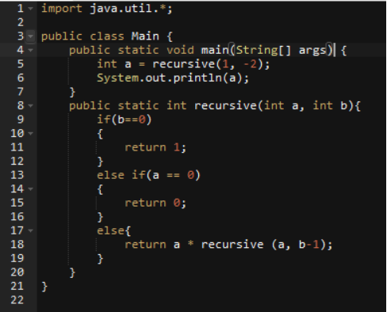

# Caso-Final-de-los-Finales-Integrador-2023-2024

https://github.com/csantillgar/Caso-Final-de-los-Finales-Integrador-2023-2024.git

### Ejercicio 1 (0.5 puntos) Tiempo estimado: 5 minutos: La calificación máxima de esta parte tipo test es de 0.5 puntos. 

1)     En relación al estado de un objeto, para preservar el principio de encapsulación:

a)    Los atributos de nuestra clase deben permanecer públicos, para permitir un acceso total a la información que almacenamos en los objetos. Sin embargo, aquellos métodos que realicen operaciones internas (y no deban ser utilizados), deben establecerse como privados.

b)    **Debemos establecer la visibilidad más restrictiva (por ejemplo, privada) en los atributos de una clase. Así, cualquier software que utilice nuestro objeto, sólo accederá al estado de los objetos mediante los métodos que le hayamos permitido utilizar.**

2)     Los métodos de una clase no pueden devolver objetos:

a)    Verdadero

b)    **Falso**

3)     ¿Cuál de las siguientes características de la programación orientada a objetos está relacionada con la reutilización de código?

a)    Abstracción

b)    **Herencia**

4)     El tiempo de acceso a un dato en una lista de tipo LinkedList es en el mejor de los casos de:

a)    O(n)

b)    **O(1)**

5)     Un algoritmo de ordenación que implemente el método de inserción se basa en la idea de ir seleccionando el número correspondiente en la lista desordenada que se va a insertar en la posición última de la lista ordenada:

a)    **Verdadero**

b)    Falso

### Ejercicio 2 (2 puntos) Tiempo estimado: 25 minutos. Responda a las cuestiones.
### Respuestas correctas suman 0.5 puntos. Se debe responder a 4 preguntas de las 5 disponibles. Las 4 preguntas a contestar son elegidas libremente por el estudiante.

2) Explica las diferencias entre una tabla Hash y un árbol. ¿ Cuándo conviene utilizar
cada una de estas estructuras? Justifique su respuesta y analice todas las
posibles operaciones a realizar por las estructuras. No redacte el orden tal y
como puede ver en los apuntes, razónelo con sus propias palabras y argumentos.

**Tabla Hash:**
- Mapea claves a valores utilizando una función de hash.
- Permite acceso rápido mediante clave pero no garantiza orden específico.

**Árbol:**
- Estructura jerárquica con nodo raíz y nodos hijos.
- Garantiza orden específico y permite operaciones eficientes como búsqueda y ordenamiento.

**Cuándo utilizar cada una:**
- Tabla Hash para acceso rápido sin necesidad de orden específico.
- Árbol cuando se requiere orden y operaciones eficientes como búsqueda y ordenamiento.

3) Explica las di ferencias entre una pila y una cola. ¿Cuándo conviene utilizar cada
una de estas estructuras? ¿Cuál es el orden de comple jidad computacional de
estas estructuras? No redacte el orden tal y como puede ver en los apuntes,
razónelo con sus propias palabras y argumentos.

**Pila:** 
Una pila es una estructura de datos que sigue el principio de "último en entrar, primero en salir" (LIFO, por sus siglas en inglés). Esto significa que el último elemento que se inserta en la pila es el primero en ser eliminado. Las operaciones principales son push (para añadir un elemento) y pop (para eliminar un elemento).

**Cola:**
 Una cola es una estructura de datos que sigue el principio de "primero en entrar, primero en salir" (FIFO, por sus siglas en inglés). Esto significa que el primer elemento que se inserta en la cola es el primero en ser eliminado. Las operaciones principales son enqueue (para añadir un elemento) y dequeue (para eliminar un elemento).

**Cuándo utilizar cada una:** 
Se puede utilizar una pila cuando se necesita un comportamiento LIFO, como en el caso de la reversión de una secuencia o la implementación de un algoritmo de backtracking. Por otro lado, se puede utilizar una cola cuando se necesita un comportamiento FIFO, como en el caso de la implementación de una cola de tareas o un sistema de impresión.

4) Explica el método de ordenación denominado inserción y describe las
iteraciones sobre el siguiente conjunto de datos:
50 20 84 13 22 16 89 85

El método de ordenación por inserción consiste en recorrer el arreglo de izquierda a derecha, en cada paso se toma un elemento y se compara con los elementos anteriores, insertándolo en la posición correcta en la secuencia ordenada.
Iteraciones sobre el conjunto de datos:
Paso 1: [20, 50, 84, 13, 22, 16, 89, 85]
Paso 2: [20, 50, 84, 13, 22, 16, 89, 85]
Paso 3: [13, 20, 50, 84, 22, 16, 89, 85]
Paso 4: [13, 20, 22, 50, 84, 16, 89, 85]
Paso 5: [13, 16, 20, 22, 50, 84, 89, 85]
Paso 6: [13, 16, 20, 22, 50, 84, 89, 85]
Paso 7: [13, 16, 20, 22, 50, 84, 85, 89]

5) Dadas dos funciones y su número de operaciones:

A = 1024n
B = 16n^3 

Calcular a partir de qué tamaño de entrada n A es más eficiente que B.

Dado A= 1024n y B= 16n^3

Para determinar el punto en el que A es más eficiente que B, igualamos ambas funciones y resolvemos para n:
Esto nos dará como resultado 8=n , lo que significa que A será más eficiente que B a partir de n=8

Ejercicio 3 (0.75 + 0.75 puntos) Tiempo estimado: 15 minutos. Dado el siguiente algoritmo recursivo:

Preguntas:
a) ¿Qué imprime el código? En caso de que no compile indique el motivo y arregle el programa
como considere conveniente. Explique su solución de manera concisa.
b) Explica brevemente qué cálculo está haciendo y qué tipo de recursividad está empleando.
Respuestas:

a) El código no compila debido a un error de sintaxis. La definición del método recursive está dentro del método main, lo cual no es permitido en Java. Para corregirlo, debemos mover la definición del método recursive fuera del método main. Aquí está la solución corregida:

import java.util.*;

public class Main {
    public static void main(String[] args) {
        int a = recursive(1, -2);
        System.out.println(a);
    }

    public static int recursive(int a, int b) {
        if (b == 0) {
            return 1;
        } else if (a == 0) {
            return 0;
        } else {
            return a * recursive(a, b - 1);
        }
    }
}

b) El código implementa un algoritmo recursivo para calcular la potencia de un número a elevado a la potencia b. El método recursive toma dos parámetros a y b, y devuelve el resultado de a elevado a b. Utiliza una forma de recursividad conocida como recursividad descendente, donde la llamada recursiva reduce el problema hacia un caso base (en este caso, cuando b llega a 0). Cada llamada recursiva multiplica a por el resultado de la llamada recursiva con b reducido en 1.

### Ejercicio 4 (1,5 punto) Tiempo estimado: 15 minutos.
Calcular de forma recursiva la suma de los dígitos de un número siendo un ejemplo el número 102 ->
1 + 0 + 2 = 3. Recuerde que puede realizar los cambios de tipo que crea necesarios para facilitar la
resolución:
¿ Qué t ipo de recursividad se está empleando? ¿ Qué comple jidad computacional
tiene el algoritmo?

Para calcular de forma recursiva la suma de los dígitos de un número, podemos seguir este enfoque:

public class Main {
    public static void main(String[] args) {
        int numero = 102;
        int suma = sumaDigitos(numero);
        System.out.println("La suma de los dígitos de " + numero + " es: " + suma);
    }

    public static int sumaDigitos(int numero) {
        if (numero == 0) {
            return 0;
        } else {
            return numero % 10 + sumaDigitos(numero / 10);
        }
    }
}

Este programa calculará recursivamente la suma de los dígitos del número dado.

Tipo de recursividad: Este algoritmo utiliza recursividad descendente, ya que reduce el problema original (la suma de los dígitos del número dado) a un caso base (cuando el número se convierte en 0).

Complejidad computacional: La complejidad computacional de este algoritmo es O log(n), donde n es el valor del número dado. Esto se debe a que el algoritmo realiza divisiones sucesivas por 10 hasta que el número se convierte en 0, lo que implica que el número de llamadas recursivas es proporcional al número de dígitos en el número original, es decir, 
log n.

### Ejercicio 5 (2.5 + 1.5 + 1 puntos) Tiempo estimado: 60 + 30 minutos extra
El ejercicio 5 podrás encontrarlo en este repositorio más arriba ya que es un ejercicio de código resuelto con intellIJ.

